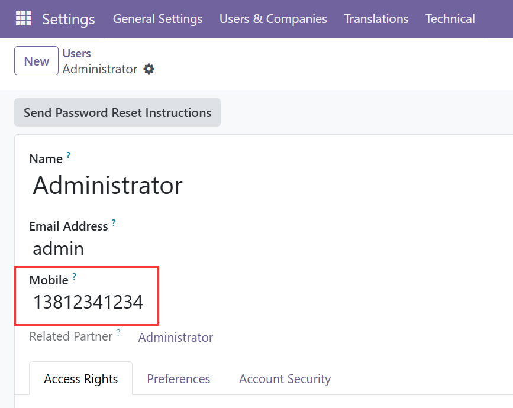
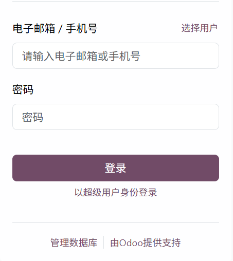

# mobile_login

This module is an extension for user login in Odoo system version 18, allowing users to maintain their mobile phone numbers and log in via those numbers.

Enable mobile number login

Enable users to login using mobile number
            Features:
            - Supports mobile phone number login
            - Mobile phone number format verification
            - Email login compatible

1.Set user login mobile number

2.Login verification

